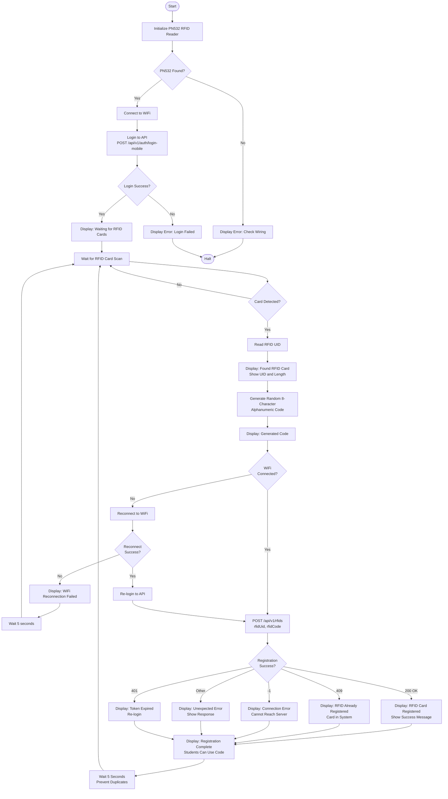
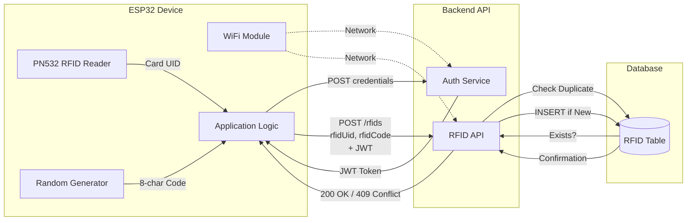

# RFID Card Registration Station - Flowchart

## Overview
ESP32 device that allows administrators to register student RFID cards by generating unique registration codes.

## System Flow

## Registration Process

1. **Card Detection**: System waits for RFID card to be scanned
2. **UID Reading**: Reads the unique identifier from the card
3. **Code Generation**: Generates random 8-character alphanumeric code
4. **API Registration**: Sends UID and code to backend
5. **Confirmation**: Displays success or error message
6. **Cooldown**: Waits 5 seconds before accepting next card

## Key Features

- **Auto Code Generation**: Creates unique 8-character alphanumeric codes
- **Duplicate Prevention**: 5-second cooldown prevents accidental re-scans
- **WiFi Recovery**: Automatically reconnects if WiFi drops
- **Auto Re-login**: Re-authenticates when token expires
- **Duplicate Detection**: Prevents registering same card twice (409 Conflict)
- **Connection Monitoring**: Detects and reports server connection issues

## Registration Code Format

- **Length**: 8 characters
- **Character Set**: 0-9, A-Z (uppercase)
- **Example**: `A3K9M2X7`
- **Purpose**: Students use this code to link RFID card to their account

## API Endpoints Used

1. `POST /api/v1/auth/login-mobile` - Authenticate and get JWT token
2. `POST /api/v1/rfids` - Register RFID card with generated code

## Hardware Configuration

- **PN532 RFID Reader** (I2C Mode)
  - VCC → 3.3V
  - GND → GND
  - SDA → GPIO 21
  - SCL → GPIO 22
  - IRQ → GPIO 4
  - RSTO → GPIO 2

## Configuration Constants

- `WIFI_SSID` - WiFi network name (ssid variable)
- `WIFI_PASSWORD` - WiFi password (password variable)
- `API_BASE_URL` - Backend API URL (apiBaseUrl variable)
- `API_IDENTIFIER` - Admin username (adminIdentifier variable)
- `API_PASSWORD` - Admin password (adminPassword variable)

## Error Handling

- **401 Unauthorized**: Token expired, system re-logs in automatically
- **409 Conflict**: Card already registered, displays message
- **-1 Connection Error**: Cannot reach backend server
- **WiFi Disconnection**: Automatically attempts reconnection (max 10 attempts)

## Student Registration Flow

After admin registers the card:
1. Admin gives the 8-character code to the student
2. Student logs into mobile app/web portal
3. Student enters the registration code
4. System links RFID card to student's account
5. Student can now use card for borrowing items

## Cooldown Period

- **Duration**: 5 seconds
- **Purpose**: Prevents duplicate registrations from same card
- **Behavior**: System ignores scans during cooldown period

## Data Flow Diagram

## Data Entities

### Input Data
- **RFID Card UID**: Hexadecimal string from card (e.g., "04A3B2C1D5E6F7")

### Generated Data
- **Registration Code**: 8-character alphanumeric (e.g., "A3K9M2X7")
  - Character set: 0-9, A-Z
  - Generated using ESP32 random number generator

### Transmitted Data
- **Login Request**: `{ identifier, password }`
- **JWT Token**: Bearer token for authentication
- **RFID Registration**: `{ rfidUid, rfidCode }`

### Database Records Created
- **Rfids Table**: New record with UID and registration code
  - `rfidUid`: Unique card identifier
  - `rfidCode`: 8-character code for student self-registration
  - `userId`: NULL (linked later when student registers)

### Response Codes
- **200 OK**: Registration successful
- **401 Unauthorized**: Token expired
- **409 Conflict**: RFID already registered
- **-1**: Connection error
